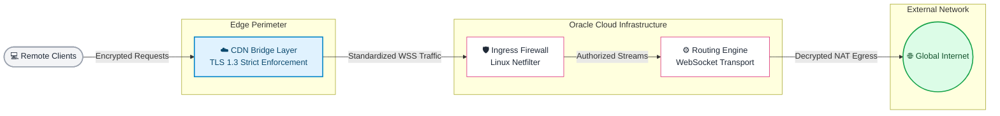

# Secure Edge Routing Infrastructure

## 📌 Project Overview
This repository contains the architectural design and system baselines for a secure, high-performance edge routing infrastructure deployed on Oracle Cloud Infrastructure (OCI). 

Engineered to operate reliably in environments with unpredictable network conditions, this architecture bridges edge-level security (CDN proxying) with transport-level optimization. The primary focus is on secure traffic encapsulation, origin server protection, and automated Linux system hardening.

## 🏗️ Core Architecture

The system routes traffic through a secure edge layer and standardizes the transport to ensure seamless compatibility with standard HTTP-based environments, effectively shielding the origin infrastructure.

    🚀 Key Engineering Features
Edge-Proxied Ingress: Standardized transport protocols exclusively on WebSocket (WS) to integrate seamlessly with CDN reverse proxies. This approach shields the origin server's direct IP and absorbs external network scanning.

Strict Security Perimeter: Enforced end-to-end TLS 1.3 encryption using custom Origin CA certificates, coupled with OS-level Netfilter (iptables) policies to drop all unauthenticated external traffic.

Kernel Optimization: Tuned the Linux networking stack by configuring IPv4/IPv6 dual-stack routing and enabling TCP BBR (Bottleneck Bandwidth and RTT) to maximize transmission efficiency and stability over high-latency routes.

📂 Repository Structure
/configs/ - Contains baseline configuration scripts for OS-level tuning (sysctl) and firewall hardening (iptables).

/assets/ - Contains exported high-resolution architecture diagrams.

🛠️ Tech Stack
Cloud & Edge: Oracle Cloud Infrastructure (OCI), Cloudflare

OS & Networking: Ubuntu Linux, TCP/IP, IPv4/IPv6 Dual-Stack

Protocols: WebSocket (WSS), TLS 1.3

Administration: Bash Scripting, Netfilter, Linux Kernel Tuning

Architected and maintained by  Milad 
