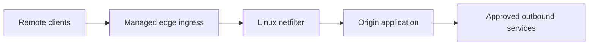

# Secure Edge Routing Infrastructure

An educational Linux and Oracle Cloud Infrastructure (OCI) project showing secure edge ingress, origin protection, and host hardening. The repository is intended to demonstrate infrastructure reasoning for cloud engineering roles. It is a reference baseline, not a managed service, security certification, or claim of production availability.

## Architecture


```mermaid
flowchart LR
    Client[Remote clients] --> Edge[Managed edge ingress]
    Edge --> FW[Linux netfilter]
    FW --> App[Origin application]
    App --> Egress[Approved outbound services]
```

The managed edge is a public trust boundary. The OCI host applies explicit stateful ingress policy, limits administration to configured networks, and can forward traffic when the workload requires it. Cloud firewall rules, application controls, TLS configuration, identity, and monitoring remain separate responsibilities.


## Engineering scope

- Conservative IPv4 and IPv6 netfilter policy with explicit administrator and edge CIDRs.
- Linux sysctl baseline for forwarding, redirect/source-route handling, TCP resilience, and measured queueing.
- Operational documentation covering assumptions, validation, monitoring, and rollback.
- Lightweight shell validation and GitHub Actions checks for syntax and unsafe regressions.

This project uses Bash, Netfilter, Linux kernel tuning, OCI concepts, and standard TLS-protected HTTP application ingress. It does not bundle an application, certificate authority, cloud provisioning, or edge-provider configuration.

## Threat model and assumptions

See [docs/security-model.md](docs/security-model.md). In brief, clients and the public network are untrusted; the edge provider, cloud account, and origin are separate trust boundaries. The baseline reduces accidental port exposure and common network misconfiguration, but does not address application vulnerabilities, stolen credentials, provider compromise, volumetric denial of service, or operational mistakes.

## Deployment and validation

Read [docs/operations.md](docs/operations.md) before changing a host. Provide administrator CIDRs and, unless intentionally choosing public HTTPS, the edge provider's current CIDRs:

```bash
export ADMIN_IPV4_CIDRS="203.0.113.10/32"
export EDGE_IPV4_CIDRS="198.51.100.0/24"
sudo -E ./configs/netfilter-hardening.sh --dry-run
sudo sysctl --system
sudo -E ./configs/netfilter-hardening.sh
```

Keep an existing SSH session open, verify a second session and the application, and retain console access. Never use an unrestricted SSH rule. Run `bash tests/validate-configs.sh`; CI also runs ShellCheck. The example networks above are documentation-only ranges and must be replaced.

## Measurable outcomes

The repository provides verifiable configuration outcomes: SSH is denied unless an administrator CIDR is supplied; edge ingress is restricted unless public HTTPS is explicitly enabled; IPv4 and IPv6 policies are both handled; syntax and policy checks run in CI. Performance, availability, latency, and security outcomes are intentionally not claimed here and must be measured in the target environment.

## Interview talking points

- **Defense in depth:** cloud security controls, managed edge policy, host firewall, kernel settings, application controls, and observability have separate responsibilities.
- **Safe operations:** the firewall requires explicit administrator networks, supports a dry-run, saves the existing rules, and documents console recovery before a change.
- **Reliability mindset:** IPv4 and IPv6 are treated consistently, return traffic is stateful, and tuning values are documented as measured starting points rather than universal defaults.
- **Honest scope:** the repository demonstrates infrastructure decisions and validation; it does not claim production scale, a security certification, or performance results without target-environment measurements.

## Repository layout

- `configs/`: host firewall and sysctl baselines.
- `docs/`: security model and operations runbook.
- `tests/`: local configuration validation.
- `assets/`: retained architecture image.
- `LICENSE`: MIT license.

## License

MIT. See [LICENSE](LICENSE).
